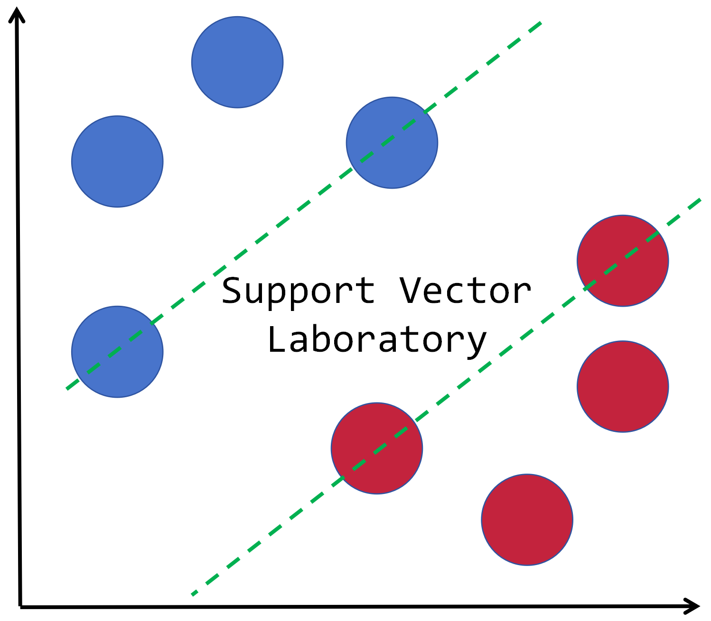

# **Support Vector Laboratory** 

[](https://github.com/define957/SupportVectorLab/actions)
[](https://github.com/define957/SupportVectorLab/issues)
[](https://github.com/define957/SupportVectorLab/stargazers)
[](https://github.com/define957/SupportVectorLab/network)
[](https://www.gnu.org/licenses/gpl-3.0)
[-lightgrey)](https://github.com/define957/SupportVectorLab)

> Advanced Toolkit for Support Vector Machines in R

***

## 📖 Introduction

**Support Vector Laboratory** is a comprehensive R package implementing various support vector machine (SVM) variants for both classification and regression tasks. Developed for educational and research purposes, this package provides:

- 15+ SVM variants with C++ acceleration
- Dual optimization via clipDCD algorithm
- Primal optimization with gradient-based methods
- Flexible kernel implementations (Linear/RBF/Polynomial)

## 🚀 Quick Start

### Prerequisites
- R (≥ 4.0)
- Rtools (Windows) / Xcode Command Line Tools (macOS)
- [Rcpp](https://cran.r-project.org/package=Rcpp) & [RcppArmadillo](https://cran.r-project.org/package=RcppArmadillo)

### Installation
```r
# Install development tools
if (!require("devtools")) install.packages("devtools")

# Install from GitHub
devtools::install_github("define957/SupportVectorLab")
```
## 🧠 Core Algorithms

### Classification Models
| Algorithm       | Loss Function        | References                   |
|-----------------|----------------------|------------------------------|
| `hinge_svm()`   | Hinge Loss           | [Cortes, C., & Vapnik, V. (1995). Support-vector networks. Machine learning, 20, 273-297.](https://link.springer.com/article/10.1007/BF00994018)   |
| `pin_svm()`     | Pinball Loss         | [Huang, X., Shi, L., & Suykens, J. A. (2013). Support vector machine classifier with pinball loss. IEEE transactions on pattern analysis and machine intelligence, 36(5), 984-997.](https://ieeexplore.ieee.org/document/6604389)  |
| `ls_svm()`      | Least Squares        | [Suykens, J. A., & Vandewalle, J. (1999). Least squares support vector machine classifiers. Neural processing letters, 9, 293-300.](https://link.springer.com/article/10.1023/A:1018628609742)          |
| `rq_svm()`      | Rescaled Quantile    | [Yang, L., & Dong, H. (2019). Robust support vector machine with generalized quantile loss for classification and regression. Applied Soft Computing, 81, 105483.](https://www.sciencedirect.com/science/article/abs/pii/S1568494619302534)  |
| `bq_svm()`      | Bounded Quantile     | [Zhang, J., & Yang, H. (2024). Bounded quantile loss for robust support vector machines-based classification and regression. Expert Systems with Applications, 242, 122759.](https://www.sciencedirect.com/science/article/abs/pii/S095741742303261X)      |
| `als_svm()`     | Asymmetric Least Sq. | [Huang, X., Shi, L., & Suykens, J. A. (2014). Asymmetric least squares support vector machine classifiers. Computational Statistics & Data Analysis, 70, 395-405.](https://www.sciencedirect.com/science/article/abs/pii/S0167947313003393)      |
| `sh_svm()`      | Squared Hinge        | [Mangasarian, O. L., & Musicant, D. R. (2001). Lagrangian support vector machines. Journal of Machine Learning Research, 1(Mar), 161-177.](https://jmlr.org/papers/volume1/mangasarian01a/html/)  |
| `en_svm()`      | Elastic Net          | [Qi, K., Yang, H., Hu, Q., & Yang, D. (2019). A new adaptive weighted imbalanced data classifier via improved support vector machines with high-dimension nature. Knowledge-Based Systems, 185, 104933.](https://www.sciencedirect.com/science/article/pii/S0950705119303764)  |


### Regression Models
| Algorithm       | Loss Function          | References                   |
|-----------------|------------------------|------------------------------|
| `eps_svr()`   | Epsilon-Insensitive Loss | [Vapnik, V. (1999). The nature of statistical learning theory. Springer science & business media.](https://link.springer.com/book/10.1007/978-1-4757-3264-1)   |

## Advanced Models
### Twin Support Vector Machine
| Algorithm       | Loss Function          | References                   |
|-----------------|------------------------|------------------------------|
| `hinge_tsvm()`  | Hinge Loss             | [Khemchandani, R., & Chandra, S. (2007). Twin support vector machines for pattern classification. IEEE Transactions on pattern analysis and machine intelligence, 29(5), 905-910.](https://www.sciencedirect.com/science/article/abs/pii/S0925231218302923)   |
| `ls_tsvm()`     | Least Squares          | [Kumar, M. A., & Gopal, M. (2009). Least squares twin support vector machines for pattern classification. Expert systems with applications, 36(4), 7535-7543.](https://www.sciencedirect.com/science/article/abs/pii/S0957417408006854)   |

### Nonparallel Hyperplane Support Vector Machine

| Algorithm       | Loss Function          | References                   |
|-----------------|------------------------|------------------------------|
| `hinge_nhsvm()` | Hinge Loss             | [Shao, Y. H., Chen, W. J., & Deng, N. Y. (2014). Nonparallel hyperplane support vector machine for binary classification problems. Information Sciences, 263, 22-35.](https://www.sciencedirect.com/science/article/abs/pii/S0020025513007883)   |


## ⚙️ Optimization Backends

| Method          | Implementation          | Best For                   | Speed Benchmark           |
|-----------------|-------------------------|----------------------------|---------------------------|
| clipDCD         | RcppArmadillo           | Dual problem optimization  | |
| SGD             | Native R                | Large-scale primal problems| |
| Adam            | Native R                | Noisy gradient problems    | |

## 🌐 Platform Support

| OS              | Architecture   | Test Status | CI/CD Passing |
|-----------------|----------------|-------------|---------------|
| Windows         | x64            | ✅ Verified  | ✔️ GitHub Actions |
| macOS           | ARM/x64        | ✅ Verified  | ✔️ GitHub Actions |
| Linux           | x64            | ⚠️ Experimental | ✔️ GitHub Actions   |

## 📚 Documentation (This section is under construction.)

Explore our comprehensive resources:
- [API Reference]()
- [Tutorials]()  
  - Beginner's Guide
  - Advanced Hyperparameter Tuning

## 🤝 Contributing

If you find bug in this package, please post an issue on the [issue](https://github.com/define957/manysvms/issues) website.

## 📬 Contact Us

### Core Team
| Role               | Name           | Contact Links                                                                                                                                 |
|---------------------|----------------|-----------------------------------------------------------------------------------------------------------------------------------------------|
| Project Maintainer  | Jiaqi Zhang    | [📧 Email](mailto:zhangjiaqi957957@outlook.com) · [💻 GitHub](https://github.com/define957)    |


## 🔐 License

GNU GENERAL PUBLIC LICENSE Version 3 (GPL-3.0)

## 📜 Citing Support Vector Laboratory

```
@article{ZHANG2024122759,
title = {Bounded quantile loss for robust support vector machines-based classification and regression},
journal = {Expert Systems with Applications},
volume = {242},
pages = {122759},
year = {2024},
issn = {0957-4174},
doi = {https://doi.org/10.1016/j.eswa.2023.122759},
url = {https://www.sciencedirect.com/science/article/pii/S095741742303261X},
author = {Jiaqi Zhang and Hu Yang},
}
```